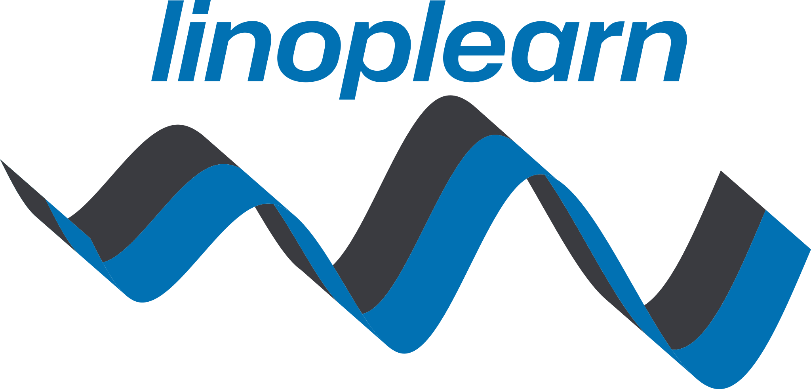

A package to learn linear operators, developed by the `Computational Statistics & Machine Learning lab <https://csml.iit.it/home>`_ at the Italian Institute of Technology.

.. toctree::
   :maxdepth: 2
   :caption: Getting Started:
   :hidden:

   Introduction <self>

.. toctree::
   :maxdepth: 2
   :caption: API Reference:
   :hidden:

   reference/kernel
   reference/nn